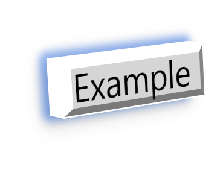

# Markdown

마크다운은 깃허브 플랫폼에서 쓰는 모든 형식의 스타일링을  지원하는 가볍고 쉬운 문법(systax)이다.


## Markdown?

마크다운은 웹에 텍스트를 디자인(꾸미는)하는 방법이다. 당신은 문서의 표현을 제어할 수 있고, 글자를 굵거나 기울도록 설정하고, 이미지를 추가, 그리고 목록을 만드는 것은 마크다운으로 할 수 있는 것의 일부분이다. 대부분, 마크다운은 평문으로 이루어지고 '#'나 '*'와 같은 몇몇의 비 알파벳 문자들로 이루어진다.

깃 허브 대부분에서 사용할 수 있다.

* Gists

* Comments in Issues and Pull Requests
* .md 혹은 .markdown 확장자 파일


## Syntax guide

* [Headers](#headers)
* [Emphasis(강조)](#Emphasis강조)
* [Lists(목록)](#Lists목록)
* [Links](#Links)
* [Images](#Images)

---


### Headers

---

> ### 사용법
>
> ```
> # 헤더1
> ## 헤더2
> ### 헤더3
> #### 헤더4
> ##### 헤더5
> ###### 헤더6
> ```
>
> ---
>
> ### 결과
>
> ---
>
> # 헤더1
>
> ## 헤더2
>
> ### 헤더3
>
> #### 헤더4
>
> ##### 헤더 5
>
> ###### 헤더 6
>
> ---


### Emphasis(강조)

---

> ### 사용법
>
> ```
> *기울이기*
> _기울이기_
> 
> **굵은글씨**
> __굵은글씨__
> 
> _기울어진 **굵은** 글씨_
> 
> ~~지우기~~
> ```
>
> ---
>
> ### 결과
>
> ---
>
> *기울이기*
> _기울이기_
>
> **굵은글씨**
> __굵은글씨__
>
> _기울어진 **굵은** 글씨_ <br />
>
> ~~지우기~~
>
> ---


### Lists(목록)

---

#### Unordered

---

> ### 사용법
>
> ```
> * 목록 1
> * 목록 2
>   * 목록 2a
>   * 목록 2b
> ```
>
> ---
>
> ### 결과
>
> ---
>
> * 목록 1
> * 목록 2
>   * 목록 2a
>   * 목록 2b
>
> ---


#### Ordered

---

> ### 사용법
>
> ---
>
> ```
> 1. 목록 1
> 1. 목록 2
> 1. 목록 3
>    1. 목록 3a
>    1. 목록 3b
> ```
>
> ---
>
> ### 결과
>
> ---
>
> 1. 목록 1
> 2. 목록 2
> 3. 목록 3
>    1. 목록 3a
>    2. 목록 3b
>
> ---


### Links

---

#### 인라인 링크

------

> '[ ]'로 텍스트를 감싸서 인라인 링크를 만들 수 있다. 그리고 '( )'안에 URL을 입력한다. 
> Ctrl + k 단축키로도 생성 가능하다.
>
> 참고 : 깃허브는 커멘트에 유효한 URL이 적힌다면, 자동으로 링크를 생성해준다. "[Autolinked references and URLS](https://help.github.com/en/articles/autolinked-references-and-urls)."
>
> ### 사용법
>
> ```
> [마크다운 문법](https://github.com/awhead/Markdown/blob/master/contents/markdownSyntax.md)
> ```
>
> ------
>
> ### 결과
>
> ------
>
> [마크다운 문법](https://github.com/awhead/Markdown/blob/master/contents/markdownSyntax.md)
>
> ------

#### 섹션링크

---

> 헤드라인을 클릭하면 해당 헤드라인으로 이동한다.
> 또한, 문서 내 헤드라인으로 이동할 수 있게 링크를 걸 수 있다.
> 
>
> ### 사용법
>
> ```
> [Test()로 이동](#test) <br /><br /><br />
> 
> 
> ### test()
> ```
>참고 : 헤드라인에 있는 특수문자는 제외하고 링크 지정
>
> ------
>
> ### 결과
>
> ------
>
> [Test()로 이동](#test)<br /><br /><br />
>
> 
>
>
> ### test()
>
> ------

#### 상대 링크(상대주소 링크, relative links)

---

>* 상대 링크를 이용하면 레포지토리 안의 다른 파일로 이동할 수 있도록 이미지 경로나 링크를 지정할 수 있다.
>
>* 깃허브는는 현재 파일을 기준으로 상대 경로를 자동으로 변환하기 때문에 상대 링크가 항상 작동한다.
>
>* ./ 및 ../와 같은 모든 상대 링크 피 연산자를 사용할 수 있다.
>
>* 상대링크는 당신의 레포지토리를 클론하는 유저가 더 쉽게 사용하도록 도와준다. 절대주소는 당신의 레포지토리에서 작동하지 않을 수 있기 때문이다.
>
>* 따라서 깃허브는 상대링크를 사용하여 다른 파일을 참조하는 것을 추천한다.
>
>---


### Images

------

> link문법 앞에 !를 붙여준다.
>
> ### 사용법
>
> ```
> 
> ```
>
> ------
>
> ### 결과
>
> ------
>
> 
>
> ------


### Blockquotes

------

> ### 사용법
>
> ```
> 
> ```
>
> ------
>
> ### 결과
>
> ------
>
> ------


### Inline code

------

> ### 사용법
>
> ```
> 
> ```
>
> ------
>
> ### 결과
>
> ------
>
> ------


# 깃허브식 마크다운(GitHub Flavored Markdown)

깃허브는 깃허브만의 문법을 사용하여 추가적인 기능들을 제공하며, 깃허브의 컨텐츠로 사용을 쉽게 해준다.


---
[돌아가기](https://github.com/awhead/Markdown)
